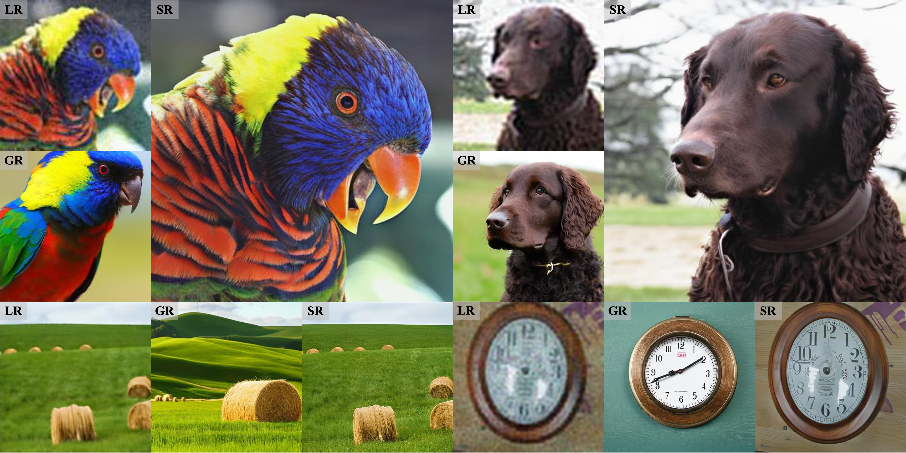

<div align="center">
<div>
  <h1>
  An unofficial implementation for "CoSeR: Bridging Image and Language for Cognitive Super-Resolution (CVPR 2024)"
  </h1>
</div>

<div>
  <a href="https://openaccess.thecvf.com/content/CVPR2024/papers/Sun_CoSeR_Bridging_Image_and_Language_for_Cognitive_Super-Resolution_CVPR_2024_paper.pdf" target="_blank">Original Paper</a>
</div>

<p align="center">
    
</p>
</div>

> *Cognitive Super-Resolution (CoSeR) is a stable diffusion-based super-resolution (SR) approach that enables SR models to “understand” low-resolution (LR) images.*

## 🔨 Installation
```
pip install -r requirements.txt
```

## 💼 Models
We provide models trained on ImageNet1000 following the settings in orginal paper: [Qformer](https://drive.google.com/file/d/1R9BPDjCFk8-EEz_fKRXv9a-YnJs6WqM7/view?usp=drive_link), [CoSeR](https://drive.google.com/file/d/1DohL4Lz8yA4jgElL_ywvI4BMtctNzZsZ/view?usp=drive_link).

## 🌟 Quick inference
Please download [Stable Diffusion 2.1](https://huggingface.co/stabilityai/stable-diffusion-2-1-base). and revise "PATH_FOR_QFORMER" and "PATH_FOR_SD" in configs/CoSeR/inference.yaml with the corresponding path. We also recommend to use the [controllable feature wrapping](https://download.openxlab.org.cn/repos/file/Iceclear/StableSR/main?filepath=vqgan_cfw_00011.ckpt&sign=6e43b120e1892145fb05c494e5151095&nonce=1720265685692) from StableSR for the complete performance. 🤗

- No image tiling, with reference image generation：

```
python scripts/inference.py \
--inputdir ... \
--outdir ... \
--config configs/CoSeR/inference.yaml \
--load_ckpt PATH_FOR_COSER \
--vqgan_ckpt PATH_FOR_CFW
```

- With image tiling, for high-resolution image reasoning:

```
python scripts/inference_tile.py \
--inputdir ... \
--outdir ... \
--config configs/CoSeR/inference.yaml \
--load_ckpt PATH_FOR_COSER \
--vqgan_ckpt PATH_FOR_CFW
```

## 🎱 Training
1. Prepare training data:
- Following the orginal paper, we process ImageNet1000 into 512*512 size. We selected a subset of 2000 images as the test set. 
```
python data/prepare_imagenet.py
```
After that, we used the Real-ESRGAN method to generate LRs for the images in the test set.

- We use BLIP2 to generate captions for every HR in the last step.
```
python data/generate_caption.py
```

- Generating ImageNet intra-class similarity (CLIP similarity) which will be used in the training of reference image attention.
```
python data/count_clip_sim.py
```

2. (**Stage 1**) Training of the cognitive encoder: (please revise "PATH_FOR_GT" and "PATH_FOR_LR" in the yaml)
```
python main.py --train --base configs/CoSeR/qformer_srresnet_imagenet_all.yaml --gpus 0,1,2,3,4,5,6,7 --name your_name
```

3. (**Stage 2**) Training of CoSeR: (please revise "PATH_FOR_QFORMER", "PATH_FOR_SD", "PATH_FOR_GT" and "PATH_FOR_LR" in the yaml)
```
python main.py --train --base configs/CoSeR/aia_512_imagenet_all_caption_clip_atten_ref.yaml --gpus 0,1,2,3,4,5,6,7 --name your_name
```

## 💙 Acknowledgments
This project is based on [StableSR](https://github.com/IceClear/StableSR). Thanks for their awesome works.
